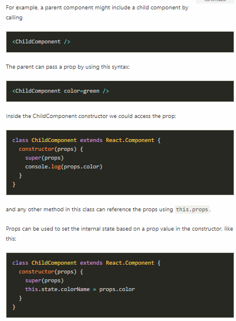

## React: Component Lifecycle Events

### What are component lifecycle events?

React lets you define components as classes or functions. The methods that you are able to use on these are called lifecycle events. These methods can be called during the lifecycle of a component, and they allow you to update the UI and application states.

**Mounting**, **Updating**, and **Unmounting** are the three phases of the component lifecycle.

### Mounting
When an instance of a component is being created and inserted into the DOM it occurs during the mounting phase. Constructor, **static getDerivedStateFromProps, render, componentDidMount, and UNSAFE_componentWillMount** all occur in this order during mounting.

### Updating
Anytime a component is updated or state changes then it is rerendered. These lifecycle events happen during updating in this order.

**static getDerivedStateFromProps, shouldComponentUpdate, render,
getSnapshotBeforeUpdate, componentDidUpdate, UNSAFE_componentWillUpdate, UNSAFE_componentWillReceiveProps**

### Unmounting
The final phase of the lifecycle if called when a component is being removed from the DOM. **componentWillUnmount** is the only lifecycle event during this phase.

**1-constructor()**
The constructor for a React component is called before it is mounted.If the component is a subclass you should call super(props), or the props will be undefined. constructors can be used to assign state using this.state or to bind event handle methods to an instance.

**2-static getDerivedStateFromProps()**
This method exists for rare cases where the state relies on changes in props over time.

**3-render()**
Render is the only required method in a class component. It will examine this.props and this.state when called. The render function should not modify the component state because it would cause a lot of bugs by changing the state every time it rerenders. I also should not directly interact with the browser. render will not be invoked if shouldComponentUpdate() returns false.

**4-componentDidMount()**
This method is invoked immediately after a component is mounted. If you need to load anything using a network request or initialize the DOM, it should go here. This method is a good place to set up any subscriptions. If you do that, don’t forget to unsubscribe in componentWillUnmount().
setState() can be called here, but it should be used sparingly, because it will cause a rerender, which can lead to perfomance issues.

**5-shouldComponentUpdate()**
The default behavior in react is to rerender after every state change. Setting shouldComponentUpdate() to false allows you to prevent this from happening. This is in order to optimize performance. If you want to use this method, it may be better to use PureComponent instead, which performs a shallow comparison of props and state. If you do decide to use this method, be sure to check the previous props and state with the current props and state. If shouldComponentUpdate() returns false, then UNSAFE_componentWillUpdate(), render(), and componentDidUpdate() will not be invoked.

**6-getSnapshotBeforeUpdate()**
This is another rarely used method that allows you to capture a picture of the DOM to check it before actually changing anything on the DOM.

**7-componentDidUpdate()**
This method is useful for performing network requests after a change has occurred.

**8-componentWillUnmount()**
This method allows you to clean up the DOM and netwrok requests/ subscriptions.

### UNSAFE Lifecycle Events
* **UNSAFE_componentWillMount()**
* **UNSAFE_componentWillUpdate()**
* **UNSAFE_componentWillReceiveProps()**

These events have lead to a lot of bugs and unintended side effects, so in React 17 these will no longer be able to be used without the UNSAFE tag in front of them. Instead of componentWillMount use ComponentDidMount.
Instead of componentWillReceiveProps use static getDerivedStateFromProps.
Instead of componentWillUpdate us getSnapshotBeforeUpdate.

### What is a Linked List?
A linked list is a linear data structure where each element is a separate object usually called a node. A node is comprised of the data and a reference to the next node. The last node has a reference to null. The head of the linked list is not a separate node. It is a reference to the first node. If the list is empty then the head is a null reference. This type of linked list is called a singly linked list.

### Higher Order Functions
**What is a higher order function?**
A higher order function is a function that takes a function as an argument(s) and/ or returns a function.

## React Bootstrap

#### Rebuilt with React
React-Bootstrap replaces the Bootstrap JavaScript. Each component has been built from scratch as a true React component, without unneeded dependencies like jQuery.

As one of the oldest React libraries, React-Bootstrap has evolved and grown alongside React, making it an excellent choice as your UI foundation.

#### Bootstrap at its core
Built with compatibility in mind, we embrace our bootstrap core and strive to be compatible with the world's largest UI ecosystem.

By relying entirely on the Bootstrap stylesheet, React-Bootstrap just works with the thousands of Bootstrap themes you already love.

#### Accessible by default
The React component model gives us more control over form and function of each component.

Each component is implemented with accessibility in mind. The result is a set of accessible-by-default components, over what is possible from plain Bootstrap.

### Netlify
 makes CI/CD, deployment and scaled hosting a commodity and helps enterprises focus on creating great dynamic consumer experiences in a Jamstack world.

 * **Deploy & Collaborate**
With just seconds of setup, The Netlify platform provides teams everything to take modern web projects from the first preview to full production

* **Integrations & Serverless**
Trigger automated deploys, integrate dozens of third-party services, and easily create serverless APIs

* **Plugins & Customization**
Use any of your favorite site generators, build technologies, or frameworks. Plugins add even more features to the build process and you can even write your own

### State vs Props
In a React component, props are variables passed to it by its parent component. State on the other hand is still variables, but directly initialized and managed by the component.

The state can be initialized by props.

