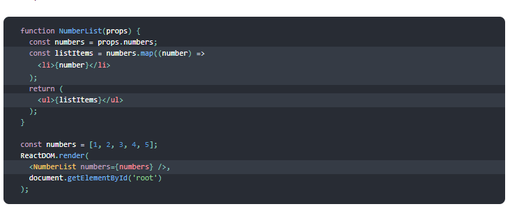
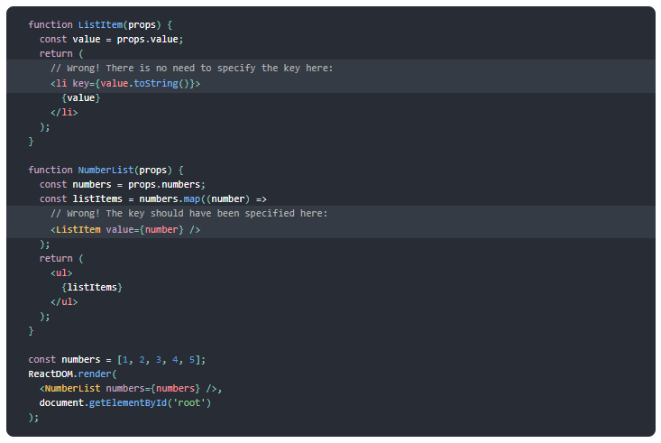

## Lists and Keys
Given the code below, we use the map() function to take an array of numbers and double their values. We assign the new array returned by map() to the variable doubled and log it:

`const numbers = [1, 2, 3, 4, 5];
const doubled = numbers.map((number) => number * 2);
console.log(doubled);`

This code `logs [2, 4, 6, 8, 10] to` the console.

In React, transforming arrays into lists of elements is nearly identical.

## Rendering Multiple Components
You can build collections of elements and include them in JSX using curly braces {}.

Below, we loop through the numbers array using the JavaScript **map()** function. We return a `li` element for each item. Finally, we assign the resulting array of elements to *listItems*:

`const numbers = [1, 2, 3, 4, 5];
const listItems = numbers.map((number) =>
  `li`{number}`li`
);`

We include the entire listItems array inside a `ul`element, and render it to the DOM:

`ReactDOM.render(`
 ` <ul>{listItems}</ul>,`
 ` document.getElementById('root')`
`);`

This code displays a **bullet list of numbers between 1 and 5**.

## Basic List Component
Usually you would render lists inside a **component**.

We can refactor the previous example into a component that accepts an array of **numbers** and outputs a list of elements.

When you run this code, you’ll be given a warning that a key should be provided for list items. A “key” is a special string attribute you need to include when creating lists of elements.

Let’s assign a key to our list items inside numbers.map() and fix the missing key issue:

## Keys
Keys **help React identify which items have changed**, are added, or are removed. Keys should be given to the elements inside the array to give the elements a stable identity:

We don’t recommend using indexes for keys if the order of items may change. This can negatively impact performance and may cause issues with component state.

## Extracting Components with Keys
If you extract a ListItem component, you should keep the key on the `ListItem ` elements in the array rather than on the `li` element in the ListItem itself.

##### Example: Incorrect Key Usage:

##### Example: Correct Key Usage

**A good rule of thumb is that elements inside the map() call need keys**.

## Keys Must Only Be Unique Among Siblings
Keys used within arrays should be unique among their siblings. However, they don’t need to be globally unique. *We can use the same keys when we produce two different arrays*:

Keys serve as a hint to React but they don’t get passed to your components. If you need the same value in your component, pass it explicitly as a prop with a different name:

`const content = posts.map((post) =>
  <Post
    key={post.id}
    id={post.id}
    title={post.title} />
);`

With the example above, the Post component can read props.id, but not props.key.

## Embedding map() in JSX

Sometimes this results in clearer code, but this style can also be abused. Like in JavaScript, it is up to you to decide whether it is worth extracting a variable for readability. Keep in mind that if the map() body is too nested, it might be a good time to extract a component.

## What is the spread operator?
In JavaScript, spread syntax refers to the use of an ellipsis of three dots **`(…)`** to expand an iterable object into the list of arguments.
When **...arr** is used in the function call, it **‘expands’ an iterable object arr into the list of arguments**.

#### What is ... used for?
Spread operator to the rescue! It looks similar to rest parameters, also using **`...`**, but does quite the opposite.

#### What else can … do?
The `…` spread operator is useful for many different routine tasks in JavaScript, including the following:
8 Copying an array
* Concatenating or combining arrays
* Using Math functions
* Using an array as arguments
* Adding an item to a list
* Adding to state in React
* Combining objects
* Converting NodeList to an array
In each case, the spread syntax expands an iterable object, usually an array, though it can be used on any interable, including a string.

##### Examples of using …
Here are a couple basic examples of using `…` in JavaScript, where I demonstrate **`copying an array`**, **`splitting a string into characters`**, and **`combining the properties of two JavaScript objects`** :

### Copying an array
Using the … spread operator is a convenient way to copy an array or combine arrays, and it can even add new items:

### Concatenating arrays
As seen in the last example, the spread operator can quickly combine two arrays, an operation known as array concatenation:

### Using Math functions
The Math object's set of functions are a perfect example of the spread operator as the only argument to a function.
One of the best ways to understand the use of spread operator in JavaScript is to look at the the built-in functions **Math.min() and Math.max()**, which both expect a list of arguments, not an array.

`const numbers = [37, -17, 7, 0]
console.log(Math.min(numbers)) // NaN
console.log(Math.min(...numbers)) // -17
console.log(Math.max(...numbers)) // 37`

### Using an array as arguments
Since the spread operator “spreads” an array into different arguments, any functions that accepts multiple any number of arguments can benefit from use of the spread operator.

### Adding an item to a list
As noted in the last example, the spread operator can add an item to an another array with a natural, easy-to-understand syntax:

`const fewFruit = ['🍏','🍊','🍌']
const fewMoreFruit = ['🍉', '🍍', ...fewFruit]
console.log(fewMoreFruit) //  Array(5) [ "🍉", "🍍", "🍏", "🍊", "🍌" ]`

### Adding to state in React
Adding an item to an array in React state is easily accomplished using the spread operator. Take the following example adapted from my article on how to add to an array in React State:

### Combining objects
The spread syntax is useful for combining the properties and methods on objects into a new object:

`
const objectOne = {hello: "🤪"}
const objectTwo = {world: "🐻"}
const objectThree = {...objectOne, ...objectTwo, laugh: "😂"}
console.log(objectThree) // Object { hello: "🤪", world: "🐻", laugh: "😂" }
const objectFour = {...objectOne, ...objectTwo, laugh: () => {console.log("😂".repeat(5))}}
objectFour.laugh() // 😂😂😂😂😂`

### Converting NodeList to Array
The spread operator can convert NodeList and arguments objects to arrays, such as when selecting HTML elements on the page:

`[...document.querySelectorAll('div')]`

### The spread operator and older browsers
When programming to support Internet Explorer and browsers on older mobile devices, the spread operator is not going to work.
In that case, the function `Function.prototype.apply()` will have the same effect as the spread syntax:

`// Using Function.prototype.apply() instead of the spread operator
[1,3,5].min() // undefined
Math.min([1,3,5]) // NaN
Math.min().apply(null, [1,3,5]) // 1
Math.max().apply(null, [1,3,5]) // 5`

### A note about copying by reference
One of the benefits of using the spread operator is that it will create a new reference to its primitive values, copying them.
That means that changes to the original array will not affect the copied array, which is what would happen if the array had been linked to the original with the assignment operator `=`:

`
const array = ['😉','😊','😇']
const copyWithEquals = array // Changes to array will change copyWithEquals
const copyWithSpread = [...array] // Changes to array will not change copyWithSpread

array[0] = '😡' // Whoops, a bug

console.log(...array) // 😡 😊 😇
console.log(...copyWithEquals) // 😡 😊 😇
console.log(...copyWithSpread) // 😉 😊 😇`

### Watch out for the deeply-nested Gotcha!
On the other hand, when JavaScript objects including arrays are deeply nested, the spread operator only copies the first level with a new reference, but the deeper values are still linked together.

## Pass functions between components
Depending on the syntax and build steps involved, there are many ways to ensure that functions have access to component attributes such as `props and state`.

**1.Bind in constructor**

While this a widely used method, it is a somewhat strange one that involves the use of the obscure word bind and requires an unnecessary line of code,It's not the best way.

**2.Bind in render**

Although we supposedly save a line of code with this approach compared to the previous one, this method is still somewhat unclear and I do not recommend using it.

**3.Arrow Function**
An arrow function expression has a shorter syntax than a function expression and does not have its own this. For this reason, you can pass it to the child component and still access the parent’s props and state.
In my opinion, this is the best way:

### Passing Parameters to an Event Handler
Examine carefully if you really need to pass parameters through the function prop to the child.
Check if you have other options, such as passing the parameter as a prop or figuring out that you don’t really need the parameter in the child component.

As mentioned before, using syntax like bind in render or an anonymous function (like in the next example) will cause the child component to re-render after each and every render of the parent — regardless of whether was changed is relevant to its child or not. That means poor performance.
As the child component receives an anonymous function as a prop, it cannot compare with the previous anonymous function (because both are anonymous). However, passing a reference to the method like
onClick={this.handleClick} lets React know that nothing has changed, so it does not re-render unnecessarily.
Example of what you shouldn’t do if you do not have to:

`<button onClick={() => this.handleClick(id)} />`

**Finally, Make Sure You Aren’t Calling the Function When You Pass It to the Component**

