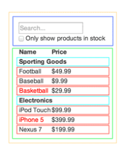

## Thinking in React

#### How would you break a mock into a component heirarchy?
The first thing you’ll want to do is to **draw boxes around every component (and subcomponent) in the mock and give them all names**. If you’re working with a designer, they may have already done this, so go talk to them! Their Photoshop layer names may end up being the names of your React components!

But how do you know what should be its own component? Use the same techniques for deciding if you should create a new function or object. One such technique is the single responsibility principle, that is, a component should ideally only do one thing. If it ends up growing, it should be decomposed into smaller subcomponents.

Since you’re often displaying a JSON data model to a user, you’ll find that if your model was built correctly, your UI (and therefore your component structure) will map nicely. That’s because UI and data models tend to adhere to the same information architecture. Separate your UI into components, where each component matches one piece of your data model.

#### What is the single responsibility principle and how does it apply to components?
It's a technique says that a component should ideally only do one thing. If it ends up growing, it should be decomposed into smaller subcomponents.

 By seperating the UI into components, where each component matches one piece of your data model.

 #### What does it mean to build a ‘static’ version of your application?
Implement your app , build a version that takes your data model and renders the UI but has no interactivity. It’s best to decouple these processes because building a static version requires a lot of typing and no thinking, and adding interactivity requires a lot of thinking and not a lot of typing. We’ll see why.

#### Once you have a static application, what do you need to add?
Props are a way of passing data from parent to child. If you’re familiar with the concept of state, don’t use state at all to build this static version. State is reserved only for interactivity, that is, data that changes over time. Since this is a static version of the app, you don’t need it.

The components will only have `render()` methods since this is a static version of your app.

The component at the top of the hierarchy (FilterableProductTable) will take your data model as a prop.

If you make a change to your underlying data model and call `ReactDOM.render()` again, the UI will be updated. You can see how your UI is updated and where to make changes. React’s one-way data flow (also called one-way binding) keeps everything modular and fast

#### What are the three questions you can ask to determine if something is state?
1. Is it passed in from a parent via props? If so, it probably isn’t state.
2. Does it remain unchanged over time? If so, it probably isn’t state.
3. Can you compute it based on any other state or props in your component? If so, it isn’t state.

#### How can you identify where state needs to live?
React is all about one-way data flow down the component hierarchy. It may not be immediately clear which component should own what state. This is often the most challenging part for newcomers to understand, so follow these steps to figure it out:

For each piece of state in your application:

Identify every component that renders something based on that state.
Find a common owner component (a single component above all the components that need the state in the hierarchy).
Either the common owner or another component higher up in the hierarchy should own the state.
If you can’t find a component where it makes sense to own the state, create a new component solely for holding the state and add it somewhere in the hierarchy above the common owner component.