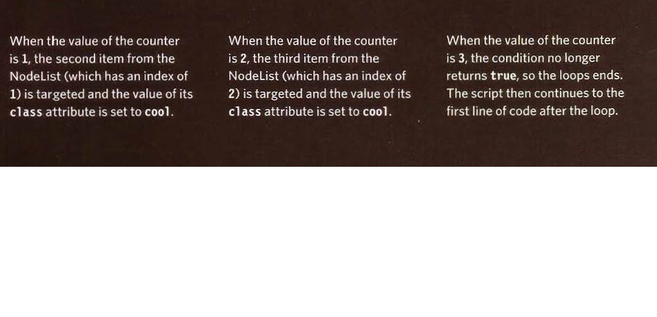

## Images 


### Controlling sizes of images in CSS

We can *control the size* of an image using the **width** and **height** properties in CSS, just like we can for any other box.

Specifying image sizes *helps pages to load more smoothly* because the HTML and CSS code will often load before the images, and telling the browser how much space to leave for an image allows it to render the rest of the page without waiting for the image to download.
We might think that our site is likely to have images of all different sizes, but a lot of sites use *the same sized image* across many of their pages.


### Aligning  images using CSS
We saw how the float property can be used to move an element to the left or the right of its containing block, allowing text to flow around it.
There are two ways that using the `` element's align attribute :
1. The float property is added to the class that was created to represent the size of the image.
2. New classes are created with names such as align-left or align-right to align the images to the left or right of the page.
These class names are used in addition to classes that indicate the size of the image.


### Centering images using CSS
By default, images are **inline elements**. This means that they flow within the surrounding text.
In order to center an image, it should be *turned into a blocklevel* element *using the display property* with a value of block.
Once it has been made into a block-level element, there are two common ways in which we
can horizontally center an image:

1.  On the *containing element*, we can use the **text-align property** with a value of center.
2.  On the *image itself*, we can use the use the **margin property** and set the values of the left and right margins to auto.


### Background Images
The background-image property allows us to place an image behind any HTML element. This could be the entire page or just part of the page. By default, a background image will
repeat to fill the entire box.
The path to the image follows the letters url, and it is put inside parentheses and quotes.
   `p{background-image: url("images/pattern.gif");}`


### Repeating Images
`background-repeat`
`background-attachment`

The background-repeat property can have four values:
1. **repeat** :  The background image is repeated both horizontally and vertically (the default way it is shown if the backgroundrepeat property isn't used).
2. **repeat-x** : The image is repeated horizontally only .
3. **repeat-y** : The image is repeated vertically only.
4. **no-repeat** : The image is only shown once.

The background-attachment property specifies whether a background image should stay in one position or move as the user scrolls up and down the page. It can have one of two values:
- **fixed** : The background image stays in the same position on the page.
- **scroll** :  The background image moves up and down as the user scrolls up and down the page.

### Background Position 
When an image is not being repeated, we can use the background-position property to specify where in the browser window the background image should be placed.
This property usually has a *pair of values* : 
- The first represents the horizontal position.
- The second represents the vertical.


### Shorthand
`Background`
The background property acts like a shorthand for all of the other background properties
we have just seen, and also the background-color property.
The properties must be specified in the following order, but we can miss any value if we do not want to specify it: 
1. background-color.
2. background-image.
3. background-repeat.
4. background-attachment.
5. background-position.

### Image Rollovers and Sprites
Using CSS, it is possible to create a link or button that changes to a second style when a user moves their mouse over it **(known as a rollover)** and a third style when
they click on it.
When the user moves their mouse over the element, or clicks on it, the position of the
background image is moved to show the relevant image.
When a single image is used for several different parts of an interface, it is known as a **sprite**.
We can add the logo and other interface elements, as well as buttons to the image.


### Dradients/ Backgroung Image
The gradient is created using the background-image property and, at the time of writing,
different browsers required a different syntax.
Since it is not supported by all browsers, it is possible to specify a background image for the box first (which would represent the gradient) and then provide the CSS alternatives for browsers that support gradients.

### Contrast Of Background Image
If we want to overlay text on a background image, **the image must be low contrast** in order for the text **to be legible**.


## Practical Information

### Search Engine Optimization (SEO )
It's the practice of trying to help our site appear nearer the top of search engine results when people look for the topics that our website covers.

In order to determine who comes first in the search results, search
engines do not only look at what appears on our site. They also consider how many sites link to us (and how relevant those links are). For this reason, SEO is often **split**into two areas:
- **on-page techniques** 
On-page techniques are the methods we can use on our web pages to improve their
rating in search engines.
The main component of this is looking at keywords that people are likely to enter into a search engine if they wanted to find our site, and then including
these in the text and HTML code for our site in order to help the search engines know that our site covers these topics.
Ensuring that any images have appropriate text in the value of their alt attribute also helps search engines understand the content of images.

- **off-page techniques**
Search engines also look at the words between the opening `<a>` tag and closing `</a>` tag in the link. If the text in the link contains keywords (rather than just click here or our website address) it may be considered more relevant.
The words that appear in links to our site should also appear in the text of the page that the site links to.

#### On-Page SEO
In every page of our website there are seven key places where keywords (the words people might search on to find our site) can appear in order to improve its **findability**:
1. Page Title.
2. URL / Web Address.
3. Headings.
4. Text.
5. Link text.
6. Image Alt Text.
7. Page Descriptions.


###### How to Identify Keywords and Phrases
Here are six steps that will help us identify the right keywords and phrases for our site :
1. Brainstorm.
2. Organize.
3. Research.
4. Compare.
5. Refine.
6. Map.

###### Analytics: Learning about our Visitors
As soon as people start coming to our site, we can start analyzing *how they found it*, *what they were looking at* and *at what point they are leaving*. 
One of the best tools for doing this is a free service offered by Google called **Google Analytics**.

- **Signing Up**
The Google Analytics service relies on us signing up for an
account at:
`www.google.com/analytics`
The site will give us a piece of tracking code which we need to put on every page of our site.

- **How It Works** 
Every time someone loads a page of our site, the tracking code sends data to the Google
servers where it is stored.
Google then provides a webbased interface that allows us to see how visitors use our site.

- **The Tracking Code** 
A tracking code is provided by Google Analytics for each website we are tracking. It should appear just before the closing `</head>` tag. The code does not alter the appearance of our web pages.

###### How Many People Are Coming to Our Site?
The overview page gives us a snapshot of the key information we are likely to want to know. In particular, it tells us how many people are coming to our site.

- Visits.
- Unique Visits.
- Page Views.
- Pages Per Visit.
- Average Time on Site.
- Date Selector.
- Export.


###### What Are Our Visitors Looking At?
The content link on the left-hand side allows us to learn more about what the visitors are looking at when they come to our site.
1. **Pages**
This tells us which pages our visitors are looking at the most and also which pages they are
spending the most time on.
2. **Landing Pages**
These are the pages that people arrive on when first visiting our site. This can be particularly helpful because we may find people are not always coming into our site via the homepage.
3. **Top Exit Pages**
This shows which pages people most commonly leave from. If a lot of people are leaving from
the same page then we might consider changing that page or improving it.
4. **Bounce Rate**
This shows the number of people
who left on the same page that
they arrived on. What counts as a bounce:
● Clicked a link to another site.
● Clicked on an advertisement.
● Entered a new URL.
● Used the "back" button.
● Closed the browser.

###### Where Are Our Visitors Coming From?
The traffic sources link on the left hand side allows us to learn where our visitors are coming from.

- Referrers.
- Direct.
- Search Terms.
- Advanced Features.

#### Domain Names & Hosting
In order to put our site on the web we will need a domain name and web hosting.

1. *Domain Names*
Our domain name is our web address (e.g. google.com or bbc.co.uk). There are many websites
that allow us to register domain names. Usually we will have to pay an annual fee to keep that domain name. 
A lot of sites that offer domain name registration also offer web hosting.

2. *Web Hoisting*
So that other people can see our site, we will need to upload it to a web server. Web servers
are special computers that are constantly connected to the Internet. They are specially set up to serve web pages when they are requested.

- Some of the key things that will help us choose which hosting company to use:
- Disk space.
- Bandwidth.
- Backups.
- Email accounts.
- Server-side languages and databases.

#### FTP & Third Party Tools

To transfer our code and images from our computer to our hosting company, we use something known as **File Transfer Protocol**.

There are many FTP programs that offer a simple interface that shows us the files on our
computer alongside the files that are on our web server. These allow us to drag and drop files from our computer to the server or vice versa.

- Here is a list of some popular FTP applications:
- **FileZilla**
`filezilla-project.org`
Windows, Mac, Linux

- **FireFTP**
`fireftp.mozdev.org`
Windows, Mac, Linux

- **CuteFTP**
`cuteftp.com`
Windows, Mac

- **SmartFTP**
`smartftp.com`
WIndows

- **Transmit**
`panic.com/transmit`
Mac

- Here is a list of some popular third party tools:
- **Blogs**
`wordpress.com`
`tumblr.com`
`posterous.com`

- **E-commerce**
`shopify.com`
`bigcartel.com`
`go.magento.com`

- **Email newsletters**
`campaignmonitor.com`
`mailchimp.com`

- **Social networking sharing buttons**
`addthis.com`
`addtoany.com`

### Selecting Elements By Tag Name
The **getElementsByTagName ()** method allows us to select elements using their tag name.


### Selecting Elementa Using CSS Selectors
- **querySelector()** returns the first element node that matches the CSS-style selector.
- **querySelectorAll()** returns a Nodelist of all of the matches.

Both methods take a CSS selector as their only parameter.
The CSS selector syntax offers more flexibility and accuracy when selecting an element than
just specifying a class name or a tag name, and should also be familiar to front-end web
developers who are used to targeting elements using CSS.

### Repeating Actions For An Entire Nodelist
When we have  Nodelist , we can loop through each node in the collection and apply the same statements to each using the *for loop*.

###### Looping Through A Nodelist
If we want to apply the same code to numerous elements, looping through a Nodelist is a powerful technique.
It involves finding out how many items are in the Nodelist, and then setting a counter to loop through them, one-by-one.
Each time the loop runs, the script checks that the counter is less than the total number of items in the Nodelist.

###### Play-By-Play

                  ```
                  for(var i =0 ; i< hotItems.length; i++){
                     hotItems[i].className = 'cool';
                  }
                  ```

 

### Video and Audio APIs
The `<video>` and `<audio>` elements allow us to embed video and audio into web pages. 

```

<video controls>
  <source src="rabbit320.mp4" type="video/mp4">
  <source src="rabbit320.webm" type="video/webm">
  <p>Your browser doesn't support HTML5 video. Here is a <a href="rabbit320.mp4">link to the video</a> instead.</p>
</video>

```

 The **HTMLMediaElement API** provides features to allow you to control video and audio players programmatically — for example HTMLMediaElement.play(), HTMLMediaElement.pause(), etc. This interface is available to both `<audio>` and `<video>` elements, as the features you'll want to implement are nearly identical. 

 ##### Playing and pausing the video
 Let's implement probably the most important control — the play/pause button.
 


