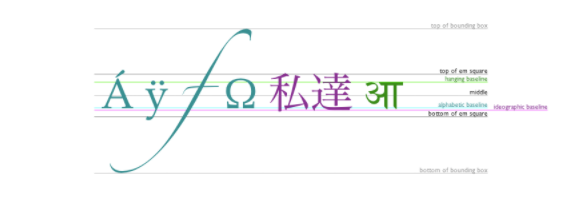

### Creating Charts

Charts are far better for displaying data visually than tables and have the added benefit that no one is ever going to press-gang them into use as a layout tool. They’re easier to look at and convey data quickly, but they’re not always easy to create.

A great way to get started with charts is with Chart.js, a JavaScript plugin that uses HTML5’s canvas element to draw the graph onto the page. It’s a well documented plugin that makes using all kinds of bar charts, line charts, pie charts and more, incredibly easy.

- **Example :**

**Drawing a line chart**


**Drawing a pie chart**


**Drawing a bar chart**


### Chart.JS

##### Creating a chart
It's easy to get started with Chart.js. All that's required is the script included in your page along with a single `<canvas>` node to render the chart.


#### The `<canvas>` element


           `<canvas id="tutorial" width="150" height="150"></canvas>`


At first sight a `<canvas>` looks like the `` element, with the only clear difference being that it doesn't have the src and alt attributes. Indeed, the `<canvas>` element has only two attributes, width and height.

The `<canvas>` element can be styled just like any normal image (margin, border, background…). These rules, however, don't affect the actual drawing on the canvas.

###### Fallback content
The `<canvas>` element differs from an `` tag in that, like for `<video>`, `<audio>`, or `<picture>` elements, it is easy to define some fallback content, to be displayed in older browsers not supporting it.

#### Required `</canvas>` tag

As a consequence of the way fallback is provided, unlike the `` element, the `<canvas>` element requires the closing tag (`</canvas>`). If this tag is not present, the rest of the document would be considered the fallback content and wouldn't be displayed.

If fallback content is not needed, a simple `<canvas id="foo" ...></canvas>` is fully compatible with all browsers that support canvas at all.

###### The rendering cotext
The `<canvas>` element creates a fixed-size drawing surface that exposes one or more rendering contexts, which are used to create and manipulate the content shown. In this tutorial, we focus on the 2D rendering context.

The canvas is initially blank. To display something, a script first needs to access the rendering context and draw on it. The `<canvas>` element has a method called **getContext()**, used to obtain the rendering context and its drawing functions. getContext() takes one parameter, the type of context. For 2D graphics

```
var canvas = document.getElementById('tutorial');
var ctx = canvas.getContext('2d');
```

#### Drawing shapes with canvas
###### The grid


#### Drawing rectangles

Unlike SVG, `<canvas>` only supports two primitive shapes: rectangles and paths (lists of points connected by lines). All other shapes must be created by combining one or more paths. Luckily, we have an assortment of path drawing functions which make it possible to compose very complex shapes.

First let's look at the rectangle. There are three functions that draw rectangles on the canvas:

fillRect(x, y, width, height)
Draws a filled rectangle.
strokeRect(x, y, width, height)
Draws a rectangular outline.
clearRect(x, y, width, height)
Clears the specified rectangular area, making it fully transparent.
Each of these three functions takes the same parameters. x and y specify the position on the canvas (relative to the origin) of the top-left corner of the rectangle. width and height provide the rectangle's size.


#### Drawing paths
Now let's look at paths. A path is a list of points, connected by segments of lines that can be of different shapes, curved or not, of different width and of different color. A path, or even a subpath, can be closed. To make shapes using paths, we take some extra steps:

1. First, you create the path.
2. Then you use drawing commands to draw into the path.
3. Once the path has been created, you can stroke or fill the path to render it.

- Here are the functions used to perform these steps:

- **beginPath()**
Creates a new path. Once created, future drawing commands are directed into the path and used to build the path up.
**Path methods**
Methods to set different paths for objects.
- **closePath()**
Adds a straight line to the path, going to the start of the current sub-path.
- **stroke()**
Draws the shape by stroking its outline.
- **fill()**
Draws a solid shape by filling the path's content area.


#### Moving the pen
- moveTo(x, y)
Moves the pen to the coordinates specified by `x` and `y`.
When the canvas is initialized or beginPath() is called, you typically will want to use the moveTo() function to place the starting point somewhere else. We could also use moveTo() to draw unconnected paths. Take a look at the smiley face below


#### Lines
- lineTo(x, y)
Draws a line from the current drawing position to the position specified by `x` and `y`.
This method takes two arguments, x and y, which are the coordinates of the line's end point. The starting point is dependent on previously drawn paths, where the end point of the previous path is the starting point for the following, etc. The starting point can also be changed by using the moveTo() method.


Also we can draw another shapes :

##### Arcs
##### Bezier and quadratic curves
##### Cubic Bezier curves

#### Path2D objects


### Applying Styles and Colors

**Colors**
Up until now we have only seen methods of the drawing context. If we want to apply colors to a shape, there are two important properties we can use: *fillStyle* and *strokeStyle*.

`fillStyle = color`
Sets the style used when filling shapes.
`strokeStyle = color`
Sets the style for shapes' outlines.
color is a string representing a CSS `<color>`, a gradient object, or a pattern object.


- **fillStyle property :**


- **strokeStyle property :**


### Transperacy
In addition to drawing opaque shapes to the canvas, we can also draw semi-transparent (or translucent) shapes. This is done by either setting the **globalAlpha property** or by assigning a semi-transparent color to the stroke and/or fill style.

**globalAlpha = transparencyValue**
Applies the specified transparency value to all future shapes drawn on the canvas. The value must be between 0.0 (fully transparent) to 1.0 (fully opaque). This value is 1.0 (fully opaque) by default.
The globalAlpha property can be useful if you want to draw a lot of shapes on the canvas with similar transparency, but otherwise it's generally more useful to set the transparency on individual shapes when setting their colors.

**Line styles**
There are several properties which allow us to style lines:

1. `lineWidth = value`
Sets the width of lines drawn in the future.
2. `lineCap = type`
Sets the appearance of the ends of lines.
3. `lineJoin = type`
Sets the appearance of the "corners" where lines meet.
4. `miterLimit = value`
Establishes a limit on the miter when two lines join at a sharp angle, to let you control how thick the junction becomes.
5. `getLineDash()`
Returns the current line dash pattern array containing an even number of non-negative numbers.
6. `setLineDash(segments)`
Sets the current line dash pattern.
7. `lineDashOffset = value`
Specifies where to start a dash array on a line.

There are many styles can be done also , check them in this website : 

  [styles](https://developer.mozilla.org/en-US/docs/Web/API/Canvas_API/Tutorial/Applying_styles_and_colors) 


### Drawing Text
The canvas rendering context provides two methods to render text:

- **fillText(text, x, y [, maxWidth])**
Fills a given text at the given (x,y) position. Optionally with a maximum width to draw.
- **strokeText(text, x, y [, maxWidth])**
Strokes a given text at the given (x,y) position. Optionally with a maximum width to draw.


##### Styling Text
 There are some more properties which let you adjust the way the text gets displayed on the canvas:

- `font = value`
The current text style being used when drawing text. This string uses the same syntax as the CSS font property. The default font is 10px sans-serif.
- `textAlign = value`
Text alignment setting. Possible values: start, end, left, right or center. The default value is start.
- `textBaseline = value`
Baseline alignment setting. Possible values: top, hanging, middle, alphabetic, ideographic, bottom. The default value is alphabetic.
- `direction = value`
Directionality. Possible values: ltr, rtl, inherit. The default value is inherit.




