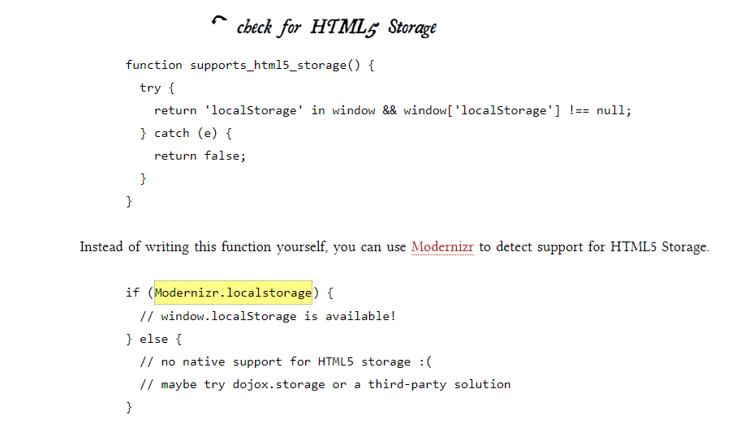

## Local Storage

Persistent local storage is one of the areas where native client applications have held an advantage over web applications. For native applications, the operating system typically provides an abstraction layer for storing and retrieving application-specific data like preferences or runtime state. These values may be stored in the registry, INI files, XML files, or some other place according to platform convention. If your native client application needs local storage beyond key/value pairs, you can embed your own database, invent your own file format, or any number of other solutions.

 Cookies were invented early in the web’s history, and indeed they can be used for persistent local storage of small amounts of data. But they have three potentially dealbreaking downsides:

* Cookies are included with every HTTP request, thereby slowing down your web application by needlessly transmitting the same data over and over
* Cookies are included with every HTTP request, thereby sending data unencrypted over the internet (unless your entire web application is served over SSL)
* Cookies are limited to about 4 KB of data — enough to slow down your application (see above), but not enough to be terribly useful
What we really want is :

1. a lot of storage space
2. on the client
3. that persists beyond a page refresh
4. and isn’t transmitted to the server

Before HTML5, all attempts to achieve this were ultimately unsatisfactory in different ways.

### HTML5 Storage
What we will refer to as **“HTML5 Storage”** is a specification named Web Storage, which was at one time part of the HTML5 specification proper, but was split out into its own specification for uninteresting political reasons. Certain browser vendors also refer to it as **“Local Storage”** or **“DOM Storage.”**

 It’s a way for web pages to store named key/value pairs locally, within the client web browser. Like cookies, this data persists even after you navigate away from the web site, close your browser tab, exit your browser, or what have you. Unlike cookies, this data is never transmitted to the remote web server (unless you go out of your way to send it manually). Unlike all previous attempts at providing persistent local storage, it is implemented natively in web browsers, so it is available even when third-party browser plugins are not.

- **HTML5 STORAGE SUPPORT**
* IE 8.0+
* FIREFOX 3.5+
* SAFARI 4.0+
* CHROME 4.0+
* OPERA 10.5+
* IPHONE 2.0+
* ANDROID 2.0+

From your JavaScript code, you’ll access HTML5 Storage through the localStorage object on the global window object:

### Using HTML Storage

HTML5 Storage is based on named **key/value pairs**. You store data based on a named key, then you can retrieve that data with the same key. The named key is a string. The data can be any type supported by JavaScript, including *strings*, *Booleans*, *integers*, or *floats*. However, the data is actually stored as a **string**. If you are storing and retrieving anything other than strings, you will need to use functions like parseInt() or parseFloat() to coerce your retrieved data into the expected JavaScript datatype.

##### Tracking changes to the HTML5 storage area

If you want to keep track programmatically of when the storage area changes, you can trap the storage event. The storage event is fired on the window object whenever *setItem()*, *removeItem()*, or *clear()* is called and actually changes something. For example, if you set an item to its existing value or call clear() when there are no named keys, the storage event will not fire, because nothing actually changed in the storage area.

#### Limitations in current browsers
1. **“5 megabytes”** is how much storage space each origin gets by default. This is surprisingly consistent across browsers, although it is phrased as no more than a suggestion in the HTML5 Storage specification. One thing to keep in mind is that you’re storing strings, not data in its original format. If you’re storing a lot of integers or floats, the difference in representation can really add up. Each digit in that float is being stored as a character, not in the usual representation of a floating point number.

2. **“QUOTA_EXCEEDED_ERR”** is the exception that will get thrown if you exceed your storage quota of 5 megabytes.

3. **“No”** is the answer to the next obvious question, “Can I ask the user for more storage space?” At time of writing (February 2011), no browser supports any mechanism for web developers to request more storage space. Some browsers (like Opera) allow the user to control each site’s storage quota, but it is purely a user-initiated action, not something that you as a web developer can build into your web application.

