## Transforms
The transform property comes in two different settings, two-dimensional and three-dimensional. Each of these come with their own individual properties and values.

### 2D Transforms
Elements may be distorted, or transformed, on both a two-dimensional plane or a three-dimensional plane. Two-dimensional transforms work on the x and y axes, known as horizontal and vertical axes. Three-dimensional transforms work on both the x and y axes, as well as the z axis. These three-dimensional transforms help define not only the length and width of an element, but also the depth. We’ll start by discussing how to transform elements on a two-dimensional plane, and then work our way into three-dimensional transforms.

#### 2D Rotate
The transform property accepts a handful of different values. The rotate value provides the ability to rotate an element from 0 to 360 degrees. Using a positive value will rotate an element clockwise, and using a negative value will rotate the element counterclockwise. The default point of rotation is the center of the element, 50% 50%, both horizontally and vertically. Later we will discuss how you can change this default point of rotation.

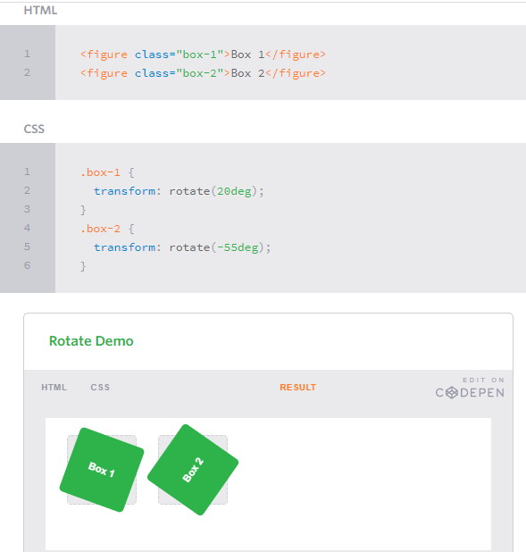

#### 2D Scale
Using the scale value within the transform property allows you to change the appeared size of an element. The default scale value is 1, therefore any value between .99 and .01 makes an element appear smaller while any value greater than or equal to 1.01 makes an element appear larger.

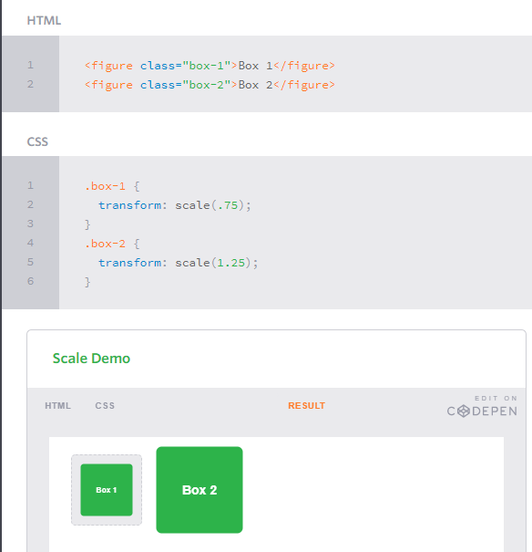

#### 2D Translate

The translate value works a bit like that of relative positioning, pushing and pulling an element in different directions without interrupting the normal flow of the document. Using the translateX value will change the position of an element on the horizontal axis while using the translateY value will change the position of an element on the vertical axis.

As with the scale value, to set both the x and y axis values at once, use the translate value and declare the x axis value first, followed by a comma, and then the y axis value.

The distance values used within the translate value may be any general length measurement, most commonly pixels or percentages. Positive values will push an element down and to the right of its default position while negative values will pull an element up and to the left of its default position.

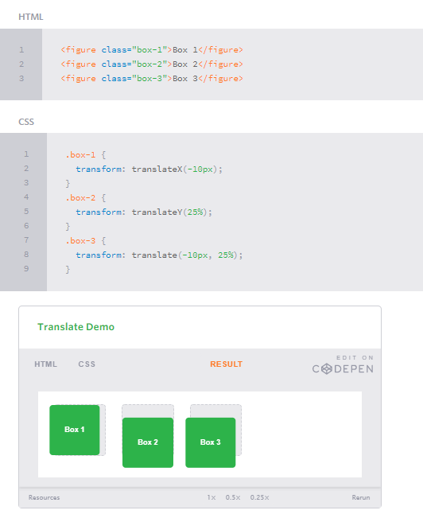

#### 2D Skew
The last transform value in the group, skew, is used to distort elements on the horizontal axis, vertical axis, or both. The syntax is very similar to that of the scale and translate values. Using the skewX value distorts an element on the horizontal axis while the skewY value distorts an element on the vertical axis. To distort an element on both axes the skew value is used, declaring the x axis value first, followed by a comma, and then the y axis value.%p

The distance calculation of the skew value is measured in units of degrees. Length measurements, such as pixels or percentages, do not apply here.

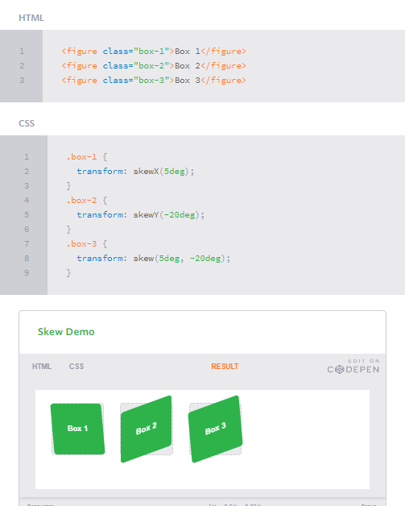

#### Combining Transforms
It is common for multiple transforms to be used at once, rotating and scaling the size of an element at the same time for example. In this event multiple transforms can be combined together. To combine transforms, list the transform values within the transform property one after the other without the use of commas.

Using multiple transform declarations will not work, as each declaration will overwrite the one above it. The behavior in that case would be the same as if you were to set the height of an element numerous times.

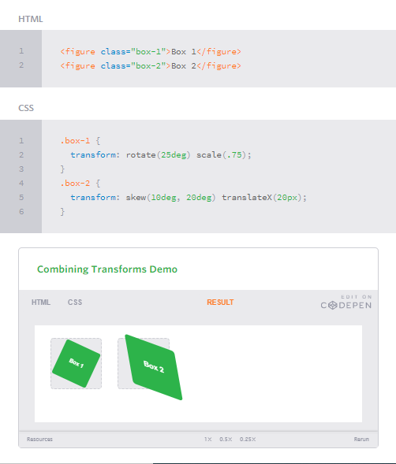

Behind every transform there is also a matrix explicitly defining the behavior of the transform. Using the rotate, scale, transition, and skew values provide an easy way to establish this matrix.

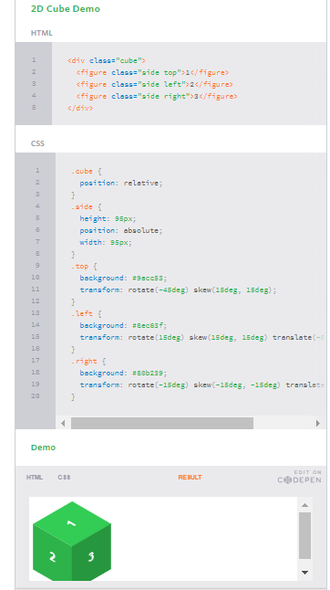

#### Transform Origin
As previously mentioned, the default transform origin is the dead center of an element, both 50% horizontally and 50% vertically. To change this default origin position the transform-origin property may be used.

The transform-origin property can accept one or two values. When only one value is specified, that value is used for both the horizontal and vertical axes. If two values are specified, the first is used for the horizontal axis and the second is used for the vertical axis.

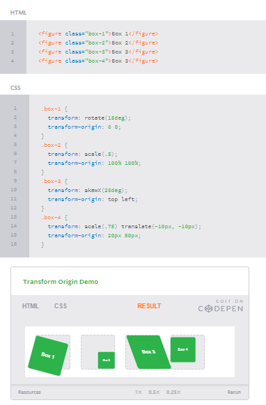

#### Perspective
In order for three-dimensional transforms to work the elements need a perspective from which to transform. The perspective for each element can be thought of as a vanishing point, similar to that which can be seen in three-dimensional drawings.

The perspective of an element can be set in two different ways. One way includes using the perspective value within the transform property on individual elements, while the other includes using the perspective property on the parent element residing over child elements being transformed.

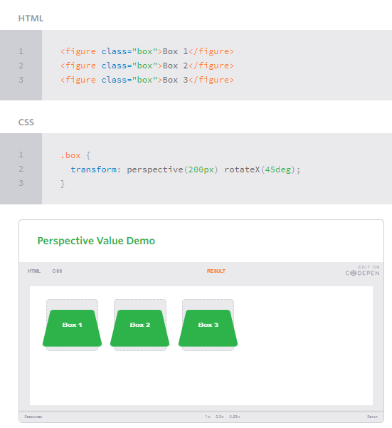

#### Perspective Depth Value
The perspective value can be set as none or a length measurement. The none value turns off any perspective, while the length value will set the depth of the perspective. The higher the value, the further away the perspective appears, thus creating a fairly low intensity perspective and a small three-dimensional change. The lower the value the closer the perspective appears, thus creating a high intensity perspective and a large three-dimensional change.

#### 3D Transforms
Working with two-dimensional transforms we are able to alter elements on the horizontal and vertical axes, however there is another axis along which we can transform elements. Using three-dimensional transforms we can change elements on the z axis, giving us control of depth as well as length and width.

#### 3D Rotate
With three-dimensional transforms we can rotate an element around any axes. To do so, we use three new transform values, including rotateX, rotateY, and rotateZ.

Using the rotateX value allows you to rotate an element around the x axis, as if it were being bent in half horizontally. Using the rotateY value allows you to rotate an element around the y axis, as if it were being bent in half vertically. Lastly, using the rotateZ value allows an element to be rotated around the z axis.

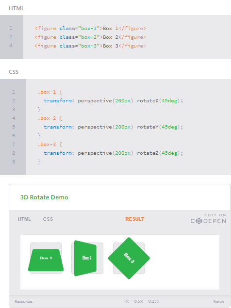

#### 3D Scale
By using the scaleZ three-dimensional transform elements may be scaled on the z axis. This isn’t extremely exciting when no other three-dimensional transforms are in place, as there is nothing in particular to scale. In the demonstration below the elements are being scaled up and down on the z axis, however the rotateX value is added in order to see the behavior of the scaleZ value. When removing the rotateX in this case, the elements will appear to be unchanged.

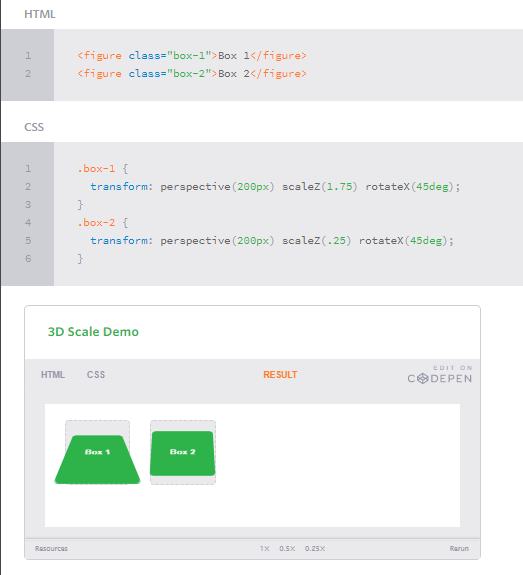

#### 3D Translate
Elements may also be translated on the z axis using the translateZ value. A negative value here will push an element further away on the z axis, resulting in a smaller element. Using a positive value will pull an element closer on the z axis, resulting in a larger element.

While this may appear to be very similar to that of the two-dimensional transform scale value, it is actually quite different. The transform is taking place on the z axis, not the x or y axes. When working with three-dimensional transforms, being able to move an element on the z axis does have great benefits, like when building the cube below for example.

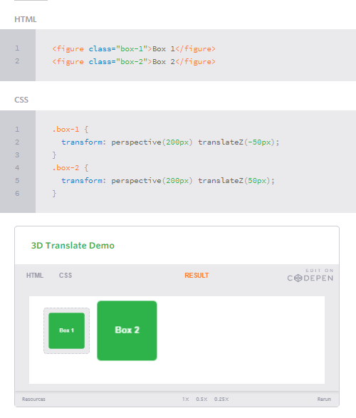

#### 3D Skew
Skew is the one two-dimensional transform that cannot be transformed on a three-dimensional scale. Elements may be skewed on the x and y axis, then transformed three-dimensionally as wished, but they cannot be skewed on the z axis.

#### Shorthand 3D Transforms
As with combining two-dimensional transforms, there are also properties to write out shorthand three-dimensional transforms. These properties include rotate3d, scale3d, transition3d, and matrix3d. These properties do require a bit more math, as well as a strong understanding of the matrices behind each transform.

#### Transform Style
On occasion three-dimensional transforms will be applied on an element that is nested within a parent element which is also being transformed. In this event, the nested, transformed elements will not appear in their own three-dimensional space. To allow nested elements to transform in their own three-dimensional plane use the transform-style property with the preserve-3d value.

The transform-style property needs to be placed on the parent element, above any nested transforms. The preserve-3d value allows the transformed children elements to appear in their own three-dimensional plane while the flat value forces the transformed children elements to lie flat on the two-dimensional plane.

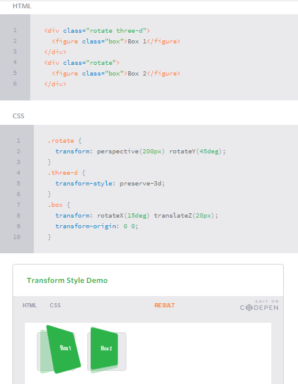

#### Backface Visibility
When working with three-dimensional transforms, elements will occasionally be transformed in a way that causes them to face away from the screen. This may be caused by setting the rotateY(180deg) value for example. By default these elements are shown from the back. So if you prefer not to see these elements at all, set the backface-visibility property to hidden, and you will hide the element whenever it is facing away from the screen.

The other value to backface-visibility is visible which is the default value, always displaying an element, no matter which direction it faces.

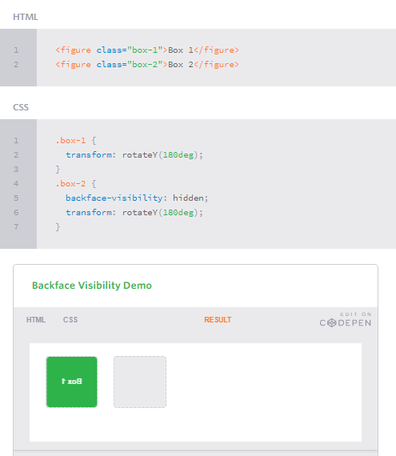

