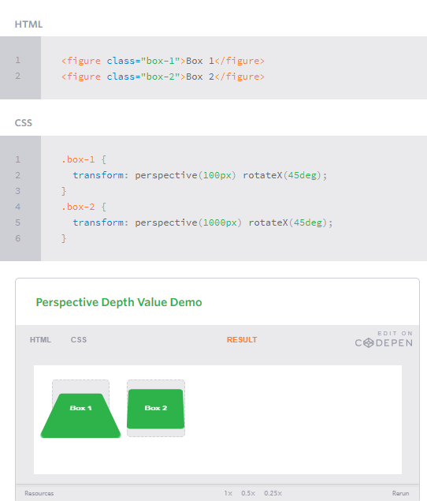

## Transforms
The transform property comes in two different settings, two-dimensional and three-dimensional. Each of these come with their own individual properties and values.

### 2D Transforms
Elements may be distorted, or transformed, on both a two-dimensional plane or a three-dimensional plane. Two-dimensional transforms work on the x and y axes, known as horizontal and vertical axes. Three-dimensional transforms work on both the x and y axes, as well as the z axis. These three-dimensional transforms help define not only the length and width of an element, but also the depth. We’ll start by discussing how to transform elements on a two-dimensional plane, and then work our way into three-dimensional transforms.

#### 2D Rotate
The transform property accepts a handful of different values. The rotate value provides the ability to rotate an element from 0 to 360 degrees. Using a positive value will rotate an element clockwise, and using a negative value will rotate the element counterclockwise. The default point of rotation is the center of the element, 50% 50%, both horizontally and vertically. Later we will discuss how you can change this default point of rotation.


#### 2D Scale
Using the scale value within the transform property allows you to change the appeared size of an element. The default scale value is 1, therefore any value between .99 and .01 makes an element appear smaller while any value greater than or equal to 1.01 makes an element appear larger.


#### 2D Translate

The translate value works a bit like that of relative positioning, pushing and pulling an element in different directions without interrupting the normal flow of the document. Using the translateX value will change the position of an element on the horizontal axis while using the translateY value will change the position of an element on the vertical axis.

As with the scale value, to set both the x and y axis values at once, use the translate value and declare the x axis value first, followed by a comma, and then the y axis value.

The distance values used within the translate value may be any general length measurement, most commonly pixels or percentages. Positive values will push an element down and to the right of its default position while negative values will pull an element up and to the left of its default position.


#### 2D Skew
The last transform value in the group, skew, is used to distort elements on the horizontal axis, vertical axis, or both. The syntax is very similar to that of the scale and translate values. Using the skewX value distorts an element on the horizontal axis while the skewY value distorts an element on the vertical axis. To distort an element on both axes the skew value is used, declaring the x axis value first, followed by a comma, and then the y axis value.%p

The distance calculation of the skew value is measured in units of degrees. Length measurements, such as pixels or percentages, do not apply here.


#### Combining Transforms
It is common for multiple transforms to be used at once, rotating and scaling the size of an element at the same time for example. In this event multiple transforms can be combined together. To combine transforms, list the transform values within the transform property one after the other without the use of commas.

Using multiple transform declarations will not work, as each declaration will overwrite the one above it. The behavior in that case would be the same as if you were to set the height of an element numerous times.


Behind every transform there is also a matrix explicitly defining the behavior of the transform. Using the rotate, scale, transition, and skew values provide an easy way to establish this matrix.


#### Transform Origin
As previously mentioned, the default transform origin is the dead center of an element, both 50% horizontally and 50% vertically. To change this default origin position the transform-origin property may be used.

The transform-origin property can accept one or two values. When only one value is specified, that value is used for both the horizontal and vertical axes. If two values are specified, the first is used for the horizontal axis and the second is used for the vertical axis.


#### Perspective
In order for three-dimensional transforms to work the elements need a perspective from which to transform. The perspective for each element can be thought of as a vanishing point, similar to that which can be seen in three-dimensional drawings.

The perspective of an element can be set in two different ways. One way includes using the perspective value within the transform property on individual elements, while the other includes using the perspective property on the parent element residing over child elements being transformed.


#### Perspective Depth Value
The perspective value can be set as none or a length measurement. The none value turns off any perspective, while the length value will set the depth of the perspective. The higher the value, the further away the perspective appears, thus creating a fairly low intensity perspective and a small three-dimensional change. The lower the value the closer the perspective appears, thus creating a high intensity perspective and a large three-dimensional change.



#### 3D Transforms
Working with two-dimensional transforms we are able to alter elements on the horizontal and vertical axes, however there is another axis along which we can transform elements. Using three-dimensional transforms we can change elements on the z axis, giving us control of depth as well as length and width.

#### 3D Rotate
With three-dimensional transforms we can rotate an element around any axes. To do so, we use three new transform values, including rotateX, rotateY, and rotateZ.

Using the rotateX value allows you to rotate an element around the x axis, as if it were being bent in half horizontally. Using the rotateY value allows you to rotate an element around the y axis, as if it were being bent in half vertically. Lastly, using the rotateZ value allows an element to be rotated around the z axis.


#### 3D Scale
By using the scaleZ three-dimensional transform elements may be scaled on the z axis. This isn’t extremely exciting when no other three-dimensional transforms are in place, as there is nothing in particular to scale. In the demonstration below the elements are being scaled up and down on the z axis, however the rotateX value is added in order to see the behavior of the scaleZ value. When removing the rotateX in this case, the elements will appear to be unchanged.


#### 3D Translate
Elements may also be translated on the z axis using the translateZ value. A negative value here will push an element further away on the z axis, resulting in a smaller element. Using a positive value will pull an element closer on the z axis, resulting in a larger element.

While this may appear to be very similar to that of the two-dimensional transform scale value, it is actually quite different. The transform is taking place on the z axis, not the x or y axes. When working with three-dimensional transforms, being able to move an element on the z axis does have great benefits, like when building the cube below for example.


#### 3D Skew
Skew is the one two-dimensional transform that cannot be transformed on a three-dimensional scale. Elements may be skewed on the x and y axis, then transformed three-dimensionally as wished, but they cannot be skewed on the z axis.

#### Shorthand 3D Transforms
As with combining two-dimensional transforms, there are also properties to write out shorthand three-dimensional transforms. These properties include rotate3d, scale3d, transition3d, and matrix3d. These properties do require a bit more math, as well as a strong understanding of the matrices behind each transform.

#### Transform Style
On occasion three-dimensional transforms will be applied on an element that is nested within a parent element which is also being transformed. In this event, the nested, transformed elements will not appear in their own three-dimensional space. To allow nested elements to transform in their own three-dimensional plane use the transform-style property with the preserve-3d value.

The transform-style property needs to be placed on the parent element, above any nested transforms. The preserve-3d value allows the transformed children elements to appear in their own three-dimensional plane while the flat value forces the transformed children elements to lie flat on the two-dimensional plane.


#### Backface Visibility
When working with three-dimensional transforms, elements will occasionally be transformed in a way that causes them to face away from the screen. This may be caused by setting the rotateY(180deg) value for example. By default these elements are shown from the back. So if you prefer not to see these elements at all, set the backface-visibility property to hidden, and you will hide the element whenever it is facing away from the screen.

The other value to backface-visibility is visible which is the default value, always displaying an element, no matter which direction it faces.


#### Transitions
With CSS3 transitions you have the potential to alter the appearance and behavior of an element whenever a state change occurs, such as when it is hovered over, focused on, active, or targeted.
There are four transition related properties in total, including transition-property, transition-duration, transition-timing-function, and transition-delay. Not all of these are required to build a transition, with the first three are the most popular


#### Transitional Property
The transition-property property determines exactly what properties will be altered in conjunction with the other transitional properties. By default, all of the properties within an element’s different states will be altered upon change. However, only the properties identified within the transition-property value will be affected by any transitions.
If multiple properties need to be transitioned they may be comma separated within the transition-property value. Additionally, the keyword value all may be used to transition all properties of an element.


##### Transitional Properties
It is important to note, not all properties may be transitioned, only properties that have an identifiable halfway point. Colors, font sizes, and the alike may be transitioned from one value to another as they have recognizable values in-between one another. The display property, for example, may not be transitioned as it does not have any midpoint. A handful of the more popular transitional properties include the following.


#### Transition Duration
The duration in which a transition takes place is set using the transition-duration property. The value of this property can be set using general timing values, including seconds (s) and milliseconds (ms). These timing values may also come in fractional measurements, .2s for example.

#### Transition Timing
The transition-timing-function property is used to set the speed in which a transition will move. Knowing the duration from the transition-duration property a transition can have multiple speeds within a single duration. A few of the more popular keyword values for the transition-timing-function property include linear, ease-in, ease-out, and ease-in-out.

The linear keyword value identifies a transition moving in a constant speed from one state to another. The ease-in value identifies a transition that starts slowly and speeds up throughout the transition, while the ease-out value identifies a transition that starts quickly and slows down throughout the transition. The ease-in-out value identifies a transition that starts slowly, speeds up in the middle, then slows down again before ending.

Each timing function has a cubic-bezier curve behind it, which can be specifically set using the cubic-bezier(x1, y1, x2, y2) value. Additional values include step-start, step-stop, and a uniquely identified steps(number_of_steps, direction) value.

#### Transition Delay
On top of declaring the transition property, duration, and timing function, you can also set a delay with the transition-delay property. The delay sets a time value, seconds or milliseconds, that determines how long a transition should be stalled before executing. As with all other transition properties, to delay numerous transitions, each delay can be declared as comma separated values.

#### Shorthand Transitions
Declaring every transition property individually can become quite intensive, especially with vendor prefixes. Fortunately there is a shorthand property, transition, capable of supporting all of these different properties and values. Using the transition value alone, you can set every transition value in the order of transition-property, transition-duration, transition-timing-function, and lastly transition-delay. Do not use commas with these values unless you are identifying numerous transitions.


###### Card Flip


### Animations
Transitions do a great job of building out visual interactions from one state to another, and are perfect for these kinds of single state changes. However, when more control is required, transitions need to have multiple states. In return, this is where animations pick up where transitions leave off.

###### Animations Keyframes
To set multiple points at which an element should undergo a transition, use the @keyframes rule. The @keyframes rule includes the animation name, any animation breakpoints, and the properties intended to be animated.


###### Animation Name
Once the keyframes for an animation have been declared they need to be assigned to an element. To do so, the animation-name property is used with the animation name, identified from the @keyframes rule, as the property value. The animation-name declaration is applied to the element in which the animation is to be applied to

``` .stage:hover .ball {
  animation-name: slide;
}
```

###### Animation Duration, Timing Function, & Delay
Once you have declared the animation-name property on an element, animations behave similarly to transitions. They include a duration, timing function, and delay if desired. To start, animations need a duration declared using the animation-duration property. As with transitions, the duration may be set in seconds or milliseconds.

```

2
3
4
5
.stage:hover .ball {
  animation-name: slide;
  animation-duration: 2s;
}
```

#### Customizing Animations
Animations also provide the ability to further customize an element’s behavior, including the ability to declare the number of times an animation runs, as well as the direction in which an animation completes.

###### Animation Iteration
By default, animations run their cycle once from beginning to end and then stop. To have an animation repeat itself numerous times the animation-iteration-count property may be used. Values for the animation-iteration-count property include either an integer or the infinite keyword. Using an integer will repeat the animation as many times as specified, while the infinite keyword will repeat the animation indefinitely in a never ending fashion.


###### Animation Direction
On top of being able to set the number of times an animation repeats, you may also declare the direction an animation completes using the animation-direction property. Values for the animation-direction property include normal, reverse, alternate, and alternate-reverse.

The normal value plays an animation as intended from beginning to end. The reverse value will play the animation exactly opposite as identified within the @keyframes rule, thus starting at 100% and working backwards to 0%.

The alternate value will play an animation forwards then backwards. Within the keyframes that includes running forward from 0% to 100% and then backwards from 100% to 0%. Using the animation-iteration-count property may limit the number of times an animation runs both forwards and backwards. The count starts at 1 running an animation forwards from 0% to 100%, then adds 1 running an animation backwards from 100% to 0%. Combining for a total of 2 iterations. The alternate value also inverses any timing functions when playing in reverse. If an animation uses the ease-in value going from 0% to 100%, it then uses the ease-out value going from 100% to 0%.


#### Play State

The animation-play-state property allows an animation to be played or paused using the running and paused keyword values respectively. When you play a paused animation, it will resume running from its current state rather than starting from the very beginning again.


#### Fade In
Having things fade in is a fairly common request from clients. It’s a great way to emphasize functionality or draw attention to a call to action.

Fade in effects are coded in two steps: first, you set the initial state; next, you set the change, for example on hover:

```
.fade
{
        opacity:0.5;
}
.fade:hover
{
        opacity:1;
}
```


#### Change color
Animating a change of color used to be unbelievably complex, with all kinds of math involved in calculating separate RGB values and then recombining them. Now, we just set the div’s class to “color” and specify the color we want in our CSS:

```
.color:hover
{
        background:#53a7ea;
}
```


 

#### Grow & Shrink
To grow an element, you used to have to use its width and height, or its padding. But now we can use CSS3’s transform to enlarge.

Set your div’s class to “grow” and then add this code to your style block:

```
.grow:hover
{
        -webkit-transform: scale(1.3);
        -ms-transform: scale(1.3);
        transform: scale(1.3);
}
```

Shrinking an element is as simple as growing it. To enlarge an element we specify a value greater than 1, to shrink it, we specify a value less than 1:

```
.shrink:hover
{
        -webkit-transform: scale(0.8);
        -ms-transform: scale(0.8);
        transform: scale(0.8);
}
```


#### Rotate elements
CSS transforms have a number of different uses, and one of the best is transforming the rotation of an element. Give your div the class “rotate” and add the following to your CSS:

```
.rotate:hover
{
        -webkit-transform: rotateZ(-360deg);
        -ms-transform: rotateZ(-360deg);
        transform: rotateZ(-360deg);
}
```


#### Square to circle

A really popular effect at the moment is transitioning a square element into a round one, and vice versa. With CSS, it’s a simple effect to achieve, we just transition the border-radius property.

Give your div the class “circle” and add this CSS to your styles:

```
.circle:hover
{
        border-radius:50%;
}
```


####  3D shadow
3D shadows were frowned upon for a year or so, because they weren’t seen as compatible with flat design, which is of course nonsense, they work fantastically well to give a user feedback on their interactions and work with flat, or fake 3D interfaces.

This effect is achieved by adding a box shadow, and then moving the element on the x axis using the transform and translate properties so that it appears to grow out of the screen.

Give your div the class “threed” and then add the following code to your CSS:

```
.threed:hover
{
        box-shadow:
                1px 1px #53a7ea,
                2px 2px #53a7ea,
                3px 3px #53a7ea;
        -webkit-transform: translateX(-3px);
        transform: translateX(-3px);
}
```


#### Swing

```
@-webkit-keyframes swing
{
    15%
    {
        -webkit-transform: translateX(5px);
        transform: translateX(5px);
    }
    30%
    {
        -webkit-transform: translateX(-5px);
       transform: translateX(-5px);
    } 
    50%
    {
        -webkit-transform: translateX(3px);
        transform: translateX(3px);
    }
    65%
    {
        -webkit-transform: translateX(-3px);
        transform: translateX(-3px);
    }
    80%
    {
        -webkit-transform: translateX(2px);
        transform: translateX(2px);
    }
    100%
    {
        -webkit-transform: translateX(0);
        transform: translateX(0);
    }
}
@keyframes swing
{
    15%
    {
        -webkit-transform: translateX(5px);
        transform: translateX(5px);
    }
    30%
    {
        -webkit-transform: translateX(-5px);
        transform: translateX(-5px);
    }
    50%
    {
        -webkit-transform: translateX(3px);
        transform: translateX(3px);
    }
    65%
    {
        -webkit-transform: translateX(-3px);
        transform: translateX(-3px);
    }
    80%
    {
        -webkit-transform: translateX(2px);
        transform: translateX(2px);
    }
    100%
    {
        -webkit-transform: translateX(0);
        transform: translateX(0);
    }
}
```

This animation simply moves the element left and right, now all we need to do is apply it:

```
.swing:hover
{
        -webkit-animation: swing 1s ease;
        animation: swing 1s ease;
        -webkit-animation-iteration-count: 1;
        animation-iteration-count: 1;
}
```


#### Inset border
One of the hottest button styles right now is the ghost button; a button with no background and a heavy border. We can of course add a border to an element simply, but that will change the element’s position. We could fix that problem using box sizing, but a far simpler solution is the transition in a border using an inset box shadow.

Give your div the class “border” and add the following CSS to your styles:

```
.border:hover
{
        box-shadow: inset 0 0 0 25px #53a7ea;
}
```


### 6 Botttons Animated


### CSS3 Animations: Keyframes


### 404


### Pure CSS Bounce Animation 

[Pure CSS Bounce Animation](https://codepen.io/dp_lewis/pres/gCfBv)

